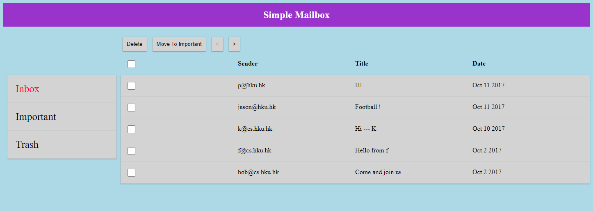
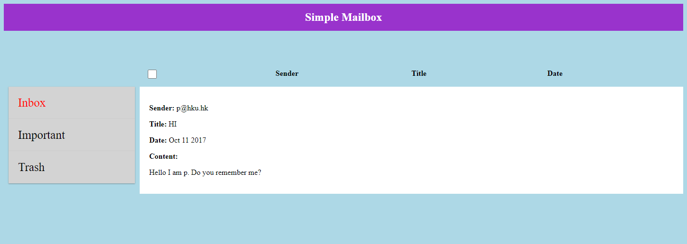

# Simple Mailbox Demo

Simple Mailbox is an application which only has functionalities to switch mails to different groups and delete mails using MySQL as the database.

*Please note that the sample data is dumped manually into the database.

Backend: PHP + MySQL 
Frontend: HTML + CSS + JS

## Demo images

